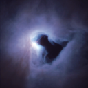

# hubble space telescope gan  
generate adversarial network for creating images resembling those taken by the hubble space telescope  
[unprocessed kaggle dataset](https://www.kaggle.com/datasets/redwankarimsony/top-100-hubble-telescope-images?resource=download)

## examples
real / training sample **opo0010a.png**  
   

generated sample  

### usage  

