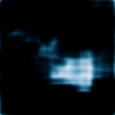

# hubble space telescope dcgan
* deep convolutional generative adversarial network, dcgan, for creating images resembling those taken by the hubble space telescope.
* the trained generator takes in 100 normally distributed numbers in the range [0, 1] and makes tensors of dim 128, 128, 3 which represent an rgb png resembling the hubble sample data imgs

**unprocessed kaggle dataset**: https://www.kaggle.com/datasets/redwankarimsony/top-100-hubble-telescope-images?resource=download  

  

## timelapse epochs 30-110

### training imgs
training sample: [opo0010a.png](./hubble_imgs_fixed/opo0010a.png)  
  

### some generated imgs
**the results get worse lol most likely because of overfitting and bad hyperparameters**
- pikachu? :sob: epoch 65: 
    
- epoch 70: 
  
- epoch 79: 
  

- epoch 106: 

#### usage  
1. install required libraries with `pip install -r 'requirements.txt'`
2. run all cells in `./hubble_tlsc.ipynb` but comment out the training
3. run second last cell to generate new images

##### notes  
- the unprocessed kaggle imgs are in compressed .tif format  
- the imgs are rgba 4 color channel imgs represented in numpy as m x n x 4 tensors  
- be careful reading the imgs into a np.ndarray as some are very large  
- recommend to retrain model to around 60 epochs to get organic images
- currently at 110 epochs model is overfitted / hyperparameters may be off a bit because the images look well pretty bad